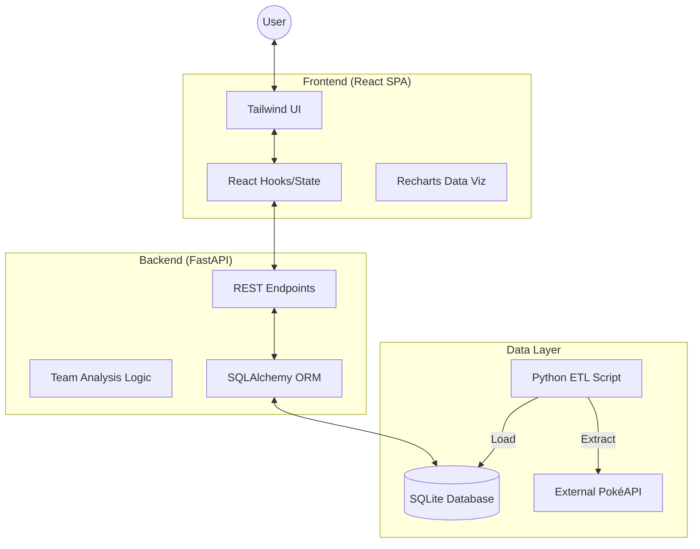

# PokéArchitect - System Architecture 🏛️

This document outlines the technical design and architectural decisions behind the PokéArchitect application.

## 🏗️ High-Level Architecture

The application follows a decoupled **Client-Server Architecture** to ensure separation of concerns and scalability.

## 📋 Component Breakdown

### 1. Frontend (Vite + React + Tailwind)
- **Component Driven**: Modular React components (TeamDock, PokemonCard, AnalysisDashboard) for high reusability.
- **Data Visualization**: Uses `recharts` for Radar (Stats) and Bar (Types) charts, providing immediate tactical feedback to the user.
- **Responsive Design**: Utilizes Tailwind CSS v4's mobile-first approach to ensure the Team Builder works on all devices.

### 2. Backend (FastAPI + Python)
- **Asynchronous Processing**: FastAPI handles concurrent requests efficiently.
- **Business Logic**: Dedicated utility functions calculate complex Pokémon type interactions (dual-type coverage) and suggest optimal team members based on identified weaknesses.
- **RESTful API**: Clean JSON endpoints for Pokémon search, detailed stats, and team analytics.

### 3. Data Engineering (ETL Pipeline)
- **ETL Strategy**: Instead of direct API calls, we use a custom pipeline (`scripts/etl_pipeline.py`).
- **Extraction**: Pulls raw data for the first 151 Pokémon and all 18 types from PokéAPI.
- **Transformation**: flattens nested JSON, handles missing sprite data, and calculates regional mapping.
- **Storage**: Sanitized data is stored in a local SQLite database for sub-millisecond query performance.

## 🛡️ Key Design Patterns

- **Decoupling**: The frontend communicates via a standard REST API, allowing the backend to be swapped or scaled independently.
- **Single Source of Truth**: The local SQLite database acts as the primary data source, protecting the app from external API downtime and rate limits.
- **State Management**: Uses React's `useState` and `useEffect` for predictable UI updates during team construction.

## 🚀 Future Scalability
- **AI Integration**: The architecture is ready for a dedicated ML service to provide "Meta-aware" team recommendations.
- **Authentication**: Ready for PostgreSQL migration to support user accounts and cloud-saved teams.
- **Expansion**: The ETL pipeline can be easily extended to fetch data for all 1000+ Pokémon.
