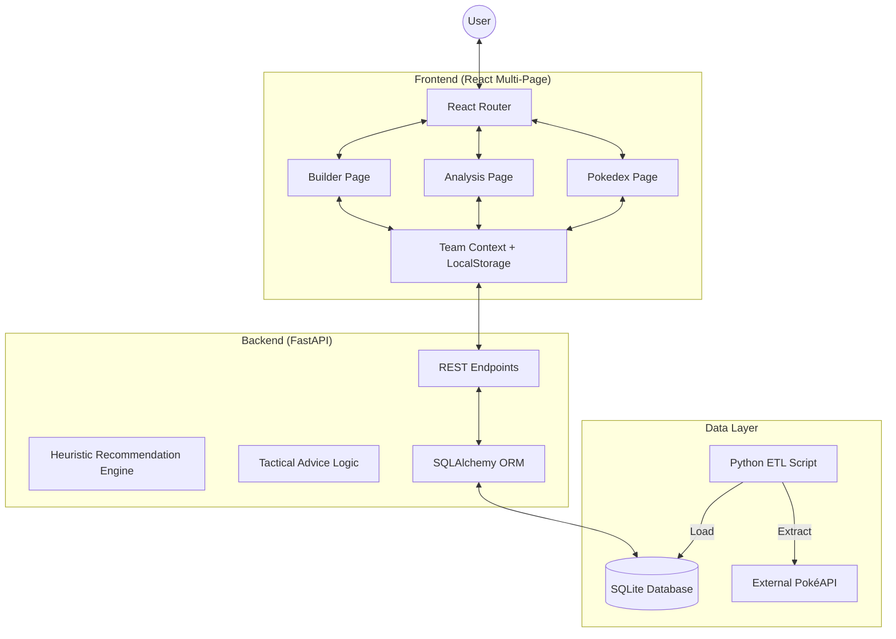

# PokéArchitect - System Architecture 🏛️

This document outlines the technical design and architectural decisions behind the PokéArchitect application.

## 🏗️ High-Level Architecture

The application follows a decoupled **Client-Server Architecture** with a Multi-Page frontend for enhanced user experience.

## 📋 Component Breakdown

### 1. Frontend (Vite + React + Tailwind)
- **Multi-Page Routing**: Uses `react-router-dom` to separate the **Builder**, **Deep Analysis**, and **PokéDex** into distinct, focused views.
- **Global State Management**: Implements a `TeamContext` provider that persists the user's selection across pages and through browser refreshes via `localStorage`.
- **Advanced Data Viz**: Utilizes `recharts` for complex radar charts and horizontal bar graphs to visualize team dynamics.
- **Dynamic UX**: Features a persistent "Team Dock" that follows the user across pages for quick access to their roster.

### 2. Backend (FastAPI + Python)
- **Heuristic Recommendation Engine**: A multi-factor algorithm that suggests members based on defensive synergy (resisting team weaknesses) and Base Stat Total (BST).
- **Team Archetype Detection**: Automatically classifies teams (e.g., "Glass Cannon", "Bulky Stall", "Balanced") by analyzing average speed, offense, and bulk metrics.
- **Tactical Advice**: Generates human-readable coaching tips based on identified critical gaps in type coverage.
- **Generation-Aware API**: All endpoints support filtering by Pokémon Generation (1-9), allowing for game-specific team building.

### 3. Data Engineering (ETL Pipeline)
- **All Generations Support**: The pipeline extracts data for all 1025+ Pokémon (Gens 1-9).
- **Enriched Metadata**: Stores regional information, generation numbers, and detailed base stats.
- **Optimized Storage**: Uses a local SQLite database for sub-millisecond query performance on large datasets.

## 🛡️ Key Design Patterns

- **Persistence Layer**: The combination of a local DB and Frontend LocalStorage ensures a seamless "offline-first" feel for team construction.
- **Single Source of Truth**: The local database acts as the primary source, protecting the app from external API rate limits.
- **Surgical Updates**: The backend uses an efficacy map pre-fetched from the database to perform high-speed type calculations without redundant queries.

## 🚀 Future Scalability
- **Cloud Hosting**: Ready for PostgreSQL migration to support multi-user accounts and shared teams.
- **Asset Optimization**: Plans for a local sprite cache to further increase performance.
